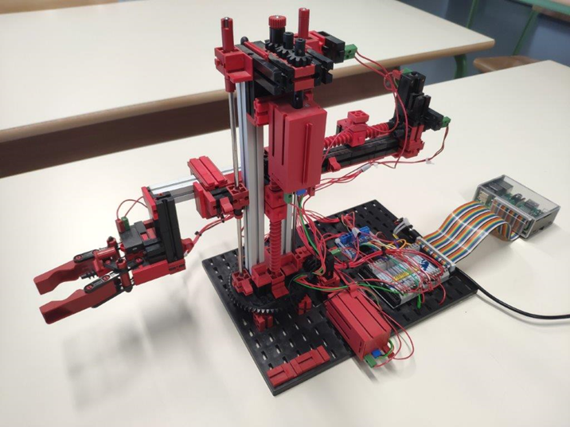
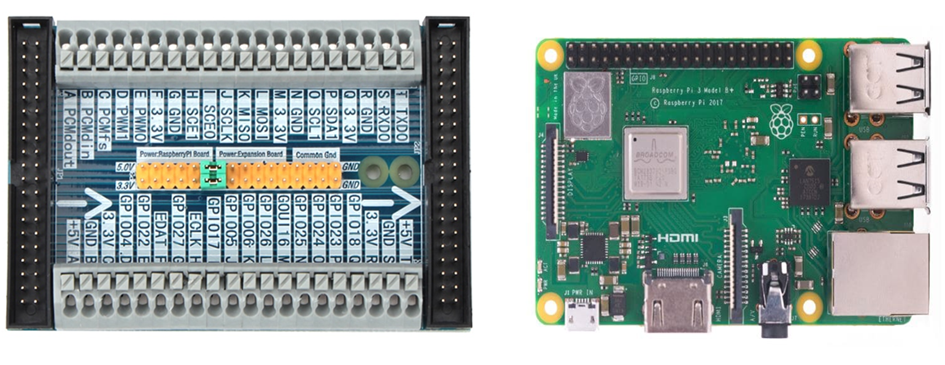
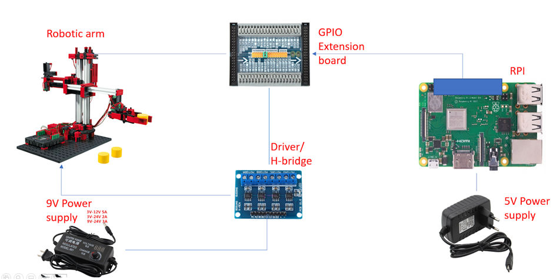
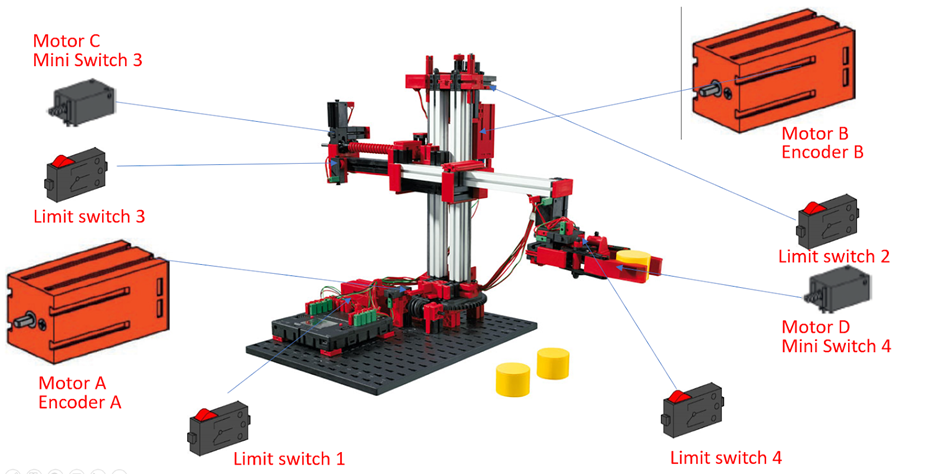
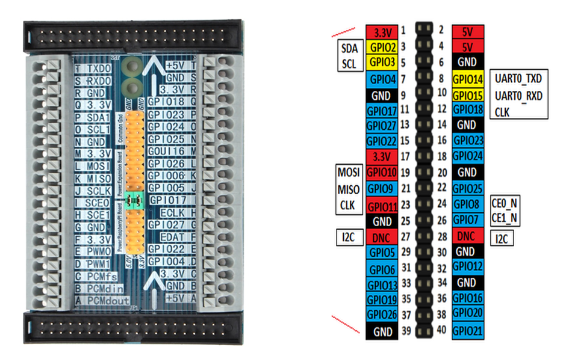
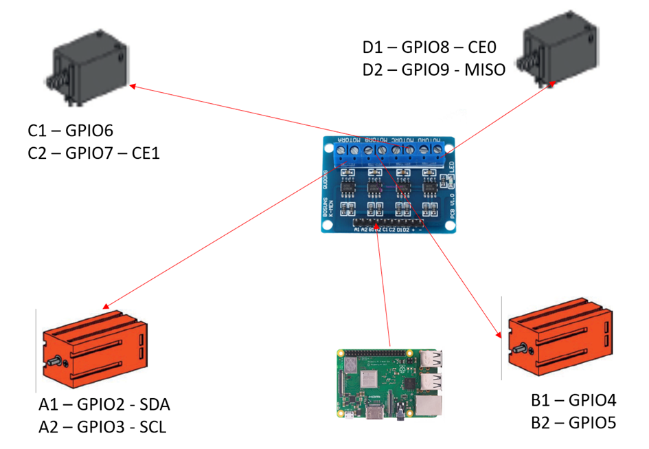
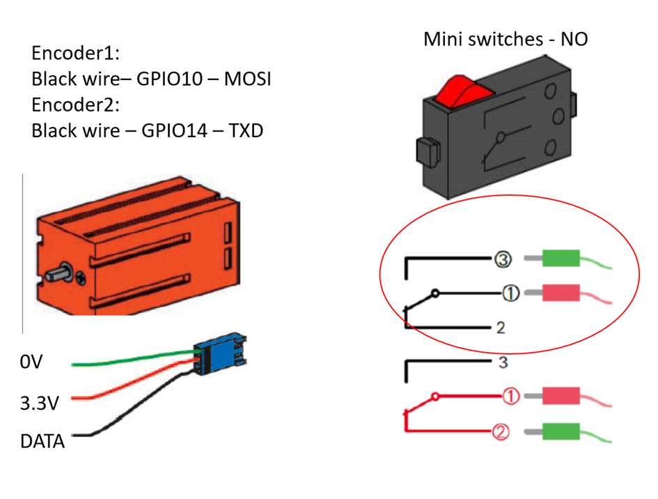

# Installation Manual

The subject of these installation instructions is a Fischertechnik robotic arm (Figure 1.),  
controlled via Raspberry PI 3b+ (RPI) (Figure 2.).

 
<b>Figure 1. Fischertechnik robotic arm</b>

 
<b>Figure 2. Raspberry Pi 3b+ with expansion board</b>

The robotic arm, RPI, power supplies, expansion board, and driver/H-bridge are connected   
according to the scheme in Figure 3. The 9V power supply is used to power the DC motors of   
the robotic arm through the driver/H-bridge. The control of the robotic arm is done with   
the RPI, through the expansion board. RPI has its own power supply of 5V. GPIO pins accept   
voltages of 3.3V.

 
<b>Figure 3. Connection scheme for power supply, RPI, expansion board, driver/H-bridge,     
and robotic arm</b>

Figure 4. shows the motors of the robotic arm with pulse counting buttons for position   
detection on each axis, and limit switches for positioning at the end position of each   
axis. Motor A and motor B have built-in incremental encoders and do not require additional   
pulse counters. The device is also equipped with an emergency stop button for immediate   
stopping of the robotic arm.

 
<b>Figure 4. Robotic arm with DC motors, pulse counting buttons, and limit switches</b>

The control of the robotic arm is done with the digital GPIO pins of RPI through the expansion   
board. The expansion board allows for easier wiring needed for controlling the robotic arm.   
Figure 5. shows the pin layout on the GPIO board, as well as the corresponding connection points   
on the expansion board.

 
<b>Figure 5. GPIO pin layout on RPI board with corresponding connection points on   
the expansion board</b>

The control of the robotic arm is done through the driver/H-bridge as follows:
- Motor A (channel A on the driver) - robot rotation
- Motor B (channel B on the driver) - vertical lifting of the robot
- Motor C (channel C on the driver) - horizontal movement
- Motor D (channel D on the driver) - gripper

Connections between the driver/H-bridge and RPI (Figure 6.):
- A1 - GPIO2 - SDA
- A2 - GPIO3 - SCL
- B1 - GPIO4
- B2 - GPIO5
- C1 - GPIO6
- C2 - GPIO7 - CE1
- D1 - GPIO8 - CE0
- D2 - GPIO9 - MISO

 
<b>Figure 6. Connection of motors and RPI to the driver/H-bridge</b>

The incremental encoders on motors A and B are connected as follows (Figure 7.):
- Software-activated internal pull-up resistors
- Green wire - 0V
- Red wire - 3.3V
- Encoder1:
  - Black wire - GPIO10 - MOSI
- Encoder2:
  - Black wire - GPIO14 - TXD

 
<b>Figure 7. Connection of incremental encoders and pulse counting buttons</b>

The pulse counting buttons and emergency stop button are connected as normally open   
(NO) buttons.   
Individual buttons are connected as follows:  
- Software-activated internal pull-down resistors  
- Middle contact on each button is connected to 3.3V (Figure 7.)  
- Green wires are connected to GPIO pins
- Limit switch 1:
  - GPIO12 - PWM0
- Limit switch 2:
  - GPIO13 - PWM1
- miniSwitch3:
  - GPIO11 - SCLK
- Limit switch 3:
  - GPIO15 - RXD
- miniSwitch4 - Gripper:
  - GPIO16
- Limit switch 4 - Gripper:
  - GPIO17
- STOP/emergencyStopButton:
  - GPIO20(PCMDin)

GPIO pins are software-configured in BCM mode

Python package installation:
- Python 3.7.3
- PySimpleGUI 4.4.1
- RPi.GPIO 0.7.0

Running the Python application in the command window:
1. Navigate to the directory with Python scripts using the `cd` command
2. Run `python3 Robotics_final.py`

