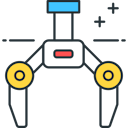

# User Guide

Controlling Fischertechnik robotic arm using Raspberry Pi.

 
<b>Figure 1. Initial application screen</b>

Before using the robotic arm, it is necessary to position the robot and save positions/coordinates.
- Press the `Positioning icon`  to open the interface shown in Figure 2.

 
<b>Figure 2. Interface for positioning the robot and saving positions/coordinates of the robotic arm</b>  

1. Use the interface and the corresponding buttons/arrows depicted in Figure 3. to bring the robotic arm   
to the desired position.
    - Blue arrows are used for moving along the X and Y axes and rotating around the Y axis (R coordinates).
    - Red arrows are used for opening and closing the gripper.
    - The dropdown menu below the blue arrows is used for saving the current X, Y, and R coordinates  
    to one of the 10 available positions.
    - The dropdown menu to the right of the red arrows is used for saving the gripper position.
    - The coordinate ranges for each axis are:
        - X: 0 (home position) - 76 (maximum movement along the X axis)
        - Y: 0 (home position) - 2200 (maximum movement along the Y axis)
        - R: 0 (home position) - 2300 (maximum rotation around the R axis)
        - G: 0 (fully open gripper) - 15 (fully closed gripper)
    - The status bar at the bottom of the interface displays the current coordinates of each axis and the  
    gripper, as well as whether the gripper is in the home position (1) or another position (0).
    - The `Homing Icon`  - When selected, this icon will reset and bring all axes and the gripper  
    back to their origin (home) positions.
    - The `Close Icon`  - This functionality performs several actions:
        - Closes the robot positioning interface/screen.
        - Transfers all the saved positions and coordinates to the temporary memory.
        - Reopens and displays the initial screen, as depicted in Figure 1 (also represented in Figure 3).

 
<b>Figure 3. Initial screen with instructions for operating the robotic armg</b>  

2. After positioning the robot and saving positions/coordinates, the initial screen is shown again (Figure 3).
    - Positions saved in the temporary memory are added to the main screen.
    - From the main screen, positions can be edited or the execution order of instructions/coordinates can be  
    loaded from a previously saved file.
    - To specify the order of instruction/coordinate execution:
        - Select previously saved positions/coordinates from the "Select robot position" or  
        "Select gripper position" menus.
        - Select one of the available positions.
        - The selected position is added to the list of sequential command execution.
        - Positioning to the selected coordinate can be done by pressing the icon `Go to coordinte icon`   
        or `Open/close griper icon` .
    - Removing a position/coordinate from the list of sequential execution can be done by double-clicking on  
    the list or by selecting the position and pressing the `Delete position icon` .
    - The menu options available are:
        - File: Open, Save as, Exit
        - Edit: Undo, Cut, Copy, Paste
        - Run: Homing, Teach Position, Run single line, Run single cycle, Run continuously
        - Help: About
    - The `Menu icons`  perform the following functions:
        - `Open icon`  : Opening previously saved sequential instructions for operating the robotic arm.
        - `Save icon`  : Saving the current sequence of instructions.
        - `Execute single command icon`  : Executing a single command from the list.
        - `Execute single cycle icon`  : Executing one cycle of sequential commands.
        - `Execute continuously icon`  : Continuously executing all commands from the list.
        - `Homing icon`  : Setting all axes to the home position.
        - `Open gripper icon`  : Fully opening the gripper.  

 
<b>Figure 4. Initial interface with screen for opening previously saved sequential instructions.</b>  